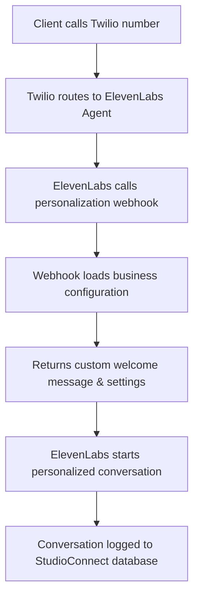

# Product Requirements Document: StudioConnect AI

**Version:** 2.0  
**Status:** In Development  
**Author:** Sonia Gibbs
**Stakeholders:** Development Team, Marketing, Sales, Leadership  
**Last Updated:** June 19. 2025

## 1. Introduction: The Problem

Creative agencies thrive on deep work and client relationships. However, their most valuable resources—the time and focus of their project managers, creatives, and leaders—are constantly eroded by a high volume of routine client communication. Every phone call to check a project's status, every email asking about the billing cycle, and every "quick question" is an interruption that forces context switching, kills momentum, and pulls skilled professionals away from billable, high-impact work.

This "interruption tax" leads to decreased operational efficiency, frustrated employees, and a client experience that feels reactive rather than proactive. Smaller agencies struggle to appear professional and responsive, while larger agencies struggle to scale their client service without ballooning their overhead. The risk of service degradation, missed calls, and inconsistent client interactions grows with every new project.

## 2. Vision & Opportunity

Our vision is to transform client communication from an operational bottleneck into a **bulletproof competitive advantage** for creative agencies.

StudioConnect AI will be the **enterprise-grade, AI-powered communication platform** that evolves with an agency's needs. It starts by serving as the perfect, professional front door (capturing leads and qualifying calls with Fortune-500-quality interactions) and matures into an indispensable AI Account Manager that is deeply integrated into the agency's workflow, capable of autonomously handling client service inquiries with unmatched reliability.

By providing a resilient, intelligent, and automated communication layer, we will free agency teams to focus on what they do best: creating exceptional work and building strategic client relationships.

## 3. Target Audience & Personas

We are building this product exclusively for Creative Agencies (branding, web design, marketing, digital, etc.).

### Persona 1: The Agency Owner / Founder
- **Goals:** Drive growth, maintain profitability, establish a premium brand presence.
- **Pains:** Missing new business opportunities after hours, stretching a small team to handle all inbound communication, high overhead costs for administrative staff.
- **Quote:** "I need to know that every potential lead is handled professionally, but I can't afford a full-time receptionist. How do we grow without breaking the bank?"

### Persona 2: The Head of Operations / Project Manager
- **Goals:** Ensure projects are delivered on time and on budget, keep clients happy, maximize team efficiency.
- **Pains:** Constant interruptions from clients asking for status updates, acting as a human router for information, repetitive manual communication tasks.
- **Quote:** "My day is a series of interruptions. If I could just get a few hours of uninterrupted time for my team, our output would skyrocket."

### Persona 3: The Client of the Agency
- **Goals:** To feel informed, valued, and confident that their project is progressing.
- **Pains:** Waiting hours or days for a simple email reply, feeling like they are "in the dark" about project status, not knowing who to contact for what.
- **Quote:** "I just want a quick update, but I feel like I'm bothering them every time I send an email."

## 4. Product Goals & Success Metrics

| Goal | Metric(s) |
|------|-----------|
| Increase Agency Operational Efficiency | - Reduce time spent by staff on routine client status inquiries by 70%<br>- Decrease number of non-billable client interruptions per day |
| Elevate Client Satisfaction & Retention | - Increase the agency's client satisfaction score (CSAT/NPS)<br>- Reduce client churn rate for our customers<br>- Achieve an average AI interaction satisfaction rating of 4/5 stars |
| Drive New Business for Agencies | - Ensure 100% of inbound calls are answered<br>- Increase lead qualification rate for inbound calls by 25% |
| Achieve Product-Market Fit & Adoption | - Achieve X number of paying subscribers within 6 months of launch<br>- Achieve Y% conversion rate from Pro to Enterprise plan |

## 5. User Stories & Requirements

This product will launch with two distinct tiers:

### Tier 1: PRO Plan ("The AI Studio Manager")
**Focus:** New Business & Professional Presence

| User Story | Acceptance Criteria |
|------------|---------------------|
| As an Agency Owner, I want the AI to answer all calls 24/7 so that I never miss a new business lead. | System handles all inbound calls to the designated Twilio number. |
| As a Studio Manager, I want to define a set of qualifying questions so that the AI can vet potential leads. | Admin dashboard allows for creation/editing of a question-and-answer flow for lead capture. |
| As an Agency Owner, I want to receive email summaries and transcripts of calls so that I can follow up. | Email notifications are sent to a designated address upon call completion with a summary, transcript, and lead details. |
| As an Agency Owner, I want to customize the AI's name and voice so that it aligns with my brand. | Admin dashboard provides options for setting the AI's persona and selecting from a list of high-quality voices. |

### Tier 2: ENTERPRISE Plan ("The AI Account Manager")
**Focus:** Bulletproof Client Service Automation & Operational Efficiency (Includes all PRO features)

| User Story | Acceptance Criteria |
|------------|---------------------|
| As a Head of Ops, I want to connect our project management tool (Asana, Jira, Monday) via a secure OAuth 2.0 flow so that the system has authorized, real-time access to project data. | Admin dashboard has a secure section to initiate an OAuth 2.0 connection for supported PM tools; the system handles the token exchange, secure storage, and automated refresh of credentials. |
| As a Head of Ops, I want the system to perform a robust, one-way sync of project data so that our AI has fast, local access to status updates. | System periodically fetches project/task data and stores relevant fields (name, status, details, client) in its own database. A manual "Sync Now" button is also available. The sync process is resilient to API failures. |
| As a Project Manager, I want the system to use Webhooks to receive real-time updates from our PM tool so that the information is always current. | System programmatically registers webhooks and can receive/process events from Asana/Jira/Monday to update the status of specific projects in its database in real-time. |
| As a Project Manager, I want the system to recognize existing clients by their phone number so that they receive a personalized, premium experience. | When a call is received, the system checks the `From` number against the agency's client list in the database and pre-loads their context, including past conversation history. |
| As a Client, I want to ask for the status of my project over the phone so that I can get an instant, accurate update without waiting for an email reply. | If an existing client asks about a project, the AI uses its synced data to provide a specific, accurate, real-time status update, delivered in a natural, conversational tone. |
| As a Head of Ops, I want to build an interactive knowledge base so that the AI can answer common client questions about our agency (e.g., billing, feedback process). | Admin dashboard includes a "Knowledge Base" section where Q&A pairs and informational content can be added for the AI to use in its responses, powered by RAG. |

#### **New: Bulletproof Enterprise Voice Agent**
| User Story | Acceptance Criteria |
|------------|---------------------|
| As a Head of Ops, I want our AI agent to have a premium, natural-sounding voice that is highly reliable. | The system defaults to ElevenLabs premium voices with enterprise-grade settings for clarity and tone. It has a built-in, automated fallback chain (ElevenLabs -> OpenAI HD TTS -> Polly) to ensure 99.99% availability. |
| As a Studio Manager, I want the voice agent to intelligently handle conversational turn-taking and interruptions. | The agent uses advanced, calibrated Voice Activity Detection (VAD) to distinguish speech from background noise. It supports client barge-in, pausing its own speech to listen, and can resume if the interruption is brief. |
| As an Agency Owner, I want to be confident our agent never responds to "phantom" speech or background noise. | A multi-layered phantom speech filter (word count, length, business context patterns, keyword validation) is applied to all transcriptions to prevent false positives and maintain a professional experience. |
| As a Head of Ops, I want the voice system to be resilient to external service failures. | The `ElevenLabsStreamingClient` is built with a circuit breaker pattern, exponential backoff for retries, and continuous quality monitoring to gracefully handle API errors or degradation without dropping calls. |

#### **New: Intelligent Lead Qualification Engine**
| User Story | Acceptance Criteria |
|------------|---------------------|
| As a Studio Manager, I want to define a dynamic, multi-step qualification process for new leads. | Admin dashboard allows creating an ordered list of questions. The `LeadQualifier` service guides the caller through the questions in a natural, conversational flow. |
| As an Agency Owner, I want the system to identify and fast-track urgent leads. | The system analyzes answers for urgency keywords (e.g., "emergency," "ASAP"). Urgent leads are flagged with `URGENT` priority. |
| As an Agency Owner, I want to be notified immediately of high-priority leads. | For leads marked as `URGENT`, the system can trigger an immediate emergency voice call to a designated number, in addition to sending a priority email notification. |
| As a Studio Manager, I want the AI to handle the qualification conversation professionally. | The AI uses context-aware transitional phrases ("Perfect, thank you for that," "Excellent, I've got that") to create a smooth, high-end client experience. |

## 6. Feature Roadmap (Next Priorities)

This section outlines the next set of high-impact features planned for development. These features are designed to deepen our integration into agency workflows and provide proactive, data-driven insights. For a detailed technical breakdown, please see the `docs/feature-plan-intelligence-scope-kb.md` document.

### 6.1. Actionable Client Intelligence
-   **Goal:** Transform raw conversation data into strategic insights for agency owners.
-   **Implementation:** A nightly cron job will analyze the previous day's call logs, aggregating conversation intents (e.g., "status update," "billing question," "scope change").
-   **Output:** A daily email digest sent to the business owner, summarizing the top client conversation trends, enabling them to spot patterns and potential areas for process improvement.

### 6.2. Real-Time Scope-Creep Guard
-   **Goal:** Proactively protect agencies from unbilled work and manage client expectations.
-   **Implementation:** A lightweight intent classifier will run in real-time on every client message. If the intent is classified as a potential "scope_change," the system will trigger an immediate alert.
-   **Output:** An instant email or SMS notification sent to the designated project manager, containing the client's request and a warning of potential scope creep.

### 6.3. Integrated Knowledge Base from PM Tools
-   **Goal:** Empower the AI agent with deep, agency-specific knowledge to answer a wider range of questions accurately.
-   **Implementation:** Agencies will be able to import documents (e.g., project briefs, client onboarding docs, technical specifications) directly from their connected project management tools (Asana, Jira, etc.).
-   **Mechanism:** These documents will be chunked, vectorized using `pgvector`, and stored in a searchable knowledge base. The AI agent will use this RAG (Retrieval-Augmented Generation) source to provide context-aware answers.

## 7. Features Out of Scope (For This Version)

To ensure a focused and timely launch, the following features will not be included in Version 1.0:

- **Two-Way Project Management Sync:** The AI will not create or update tasks in Asana/Jira via voice commands. The integration is focused on reading project data and status.
- **Individual User-Level OAuth:** The integration uses a single, per-business OAuth 2.0 connection, not connections authenticated by individual end-users within the agency.
- **Client-Facing Dashboard:** The agency's clients will not have a portal to log into. All interaction is via voice and other defined channels.
- **Multi-Language Support:** The system will launch with English-only support.
- **Chat/SMS Integration:** This version is focused exclusively on perfecting the voice channel.

## 8. Design & UX Considerations

The user interface for the admin dashboard must be clean, intuitive, and simple. Agency owners are busy and not necessarily deeply technical. The design should inspire confidence and professionalism, mirroring the quality they provide to their own clients. The setup process for integrations and AI configuration must be guided and include clear validation steps.

## 9. Technical Architecture

### 9.1 System Overview
The StudioConnect AI platform is built on a modern, scalable architecture using Node.js, TypeScript, and PostgreSQL with pgvector for AI embeddings. The system leverages **ElevenLabs Conversational AI platform** as its core voice infrastructure, providing enterprise-grade reliability and natural conversation capabilities. The architecture emphasizes multi-tenant support, configuration-driven behavior, and seamless integration with business dashboards.

### 9.2 Core Components

#### API Layer
- **Express.js REST API**: Handles HTTP requests and webhook integrations
- **Multi-Tenant Webhook System**: Dynamic personalization for ElevenLabs agents per business
- **Authentication Middleware**: JWT-based authentication with role-based access control
- **Rate Limiting**: Per-IP and per-business rate limiting for API endpoints

#### AI & Voice Processing (ElevenLabs Native Platform)
- **ElevenLabs Conversational AI**: 
  - **Primary voice platform** handling all conversation logic
  - Native speech-to-text, text-to-speech, and turn-taking models
  - Built-in support for thousands of concurrent calls
  - Premium voice selection (Jessica, Hope, Archer) for enterprise quality
- **Dynamic Agent Configuration**:
  - **Multi-tenant webhook personalization**: Each business gets custom welcome messages, system prompts, and voice selection
  - **Real-time configuration loading**: Business settings pulled from database during call initiation
  - **Client recognition**: Existing clients receive personalized greetings and context
- **Conversation Management**:
  - **GPT-4 integration** for intelligent conversation handling
  - **Claude and Gemini support** for diverse LLM options
  - **Custom system prompts** per business for brand-specific conversations

#### Data Layer
- **PostgreSQL**: Primary database with pgvector extension for AI embeddings
- **Redis**: Session management and caching
- **Prisma ORM**: Type-safe database access
- **Data Models**:
  ```typescript
  // Core Models
  interface Business {
    id: string
    name: string
    plan: 'PRO' | 'ENTERPRISE'
    settings: BusinessSettings
    integrations: Integration[]
  }

  interface Client {
    id: string
    businessId: string
    name: string
    phone: string
    email: string
    projects: Project[]
  }

  interface Project {
    id: string
    businessId: string
    clientId: string
    name: string
    status: ProjectStatus
    pmToolId: string
    lastSync: Date
  }
  ```

### 9.3 ElevenLabs Conversational AI Integration

#### Architecture Overview
The platform now leverages ElevenLabs' enterprise-grade Conversational AI platform as its primary voice infrastructure, replacing the previous custom-built pipeline with a production-ready solution.

#### Key Benefits
- **Enterprise Reliability**: Built-in support for thousands of concurrent calls with 99.9% uptime
- **Natural Conversations**: Advanced turn-taking models and premium voice quality
- **Multi-Tenant Support**: Dynamic agent personalization via webhook integration
- **Reduced Complexity**: Eliminates custom audio processing, VAD, and TTS management
- **Cost Efficiency**: $0.08/minute on business plan vs. custom infrastructure costs

#### Implementation Details
- **Agent Configuration**: Each business can have custom ElevenLabs agents with specific voices and prompts
- **Webhook Personalization**: `/api/voice/elevenlabs-personalization` endpoint provides dynamic configuration
- **Voice Selection**: Premium voices (Jessica, Hope, Archer) selected based on business preferences and client type
- **System Prompts**: Business-specific conversation patterns and escalation rules
- **Call Transfer**: Native integration with Twilio for seamless human handoff

#### Post-Call Analytics Webhook
- **Endpoint**: `POST /api/voice/elevenlabs-post-call`
- **Purpose**: Captures detailed call analytics and conversation data from ElevenLabs
- **Configuration**: Set in ElevenLabs agent settings under "Post-call webhook URL"
- **Data Captured**:
  - Call duration and quality metrics
  - Full conversation transcript with timestamps
  - Sentiment analysis and conversation summary
  - Action items and follow-up requirements
  - Client satisfaction scores (if collected)
- **Dashboard Integration**: All captured data is immediately available in:
  - Call history tables
  - Analytics dashboard with KPI cards
  - Client interaction timelines
  - Agent performance metrics

#### Multi-Tenant Webhook Flow


### 9.4 Integration Architecture

#### Project Management Tools
- **Supported Platforms**: Asana, Jira, Monday.com
- **Core Design**: The integration is built on a provider-based architecture. A common `ProjectManagementProvider` interface defines a contract for all supported platforms, ensuring consistent integration with the core application. This allows for modular, scalable, and maintainable connections to third-party services.

#### Integration Flow
The integration process follows a standardized flow for each provider, consisting of authentication, data synchronization, and real-time updates via webhooks.

1.  **Authentication**: The system uses a secure, per-business **OAuth 2.0 flow** to connect to PM tools. It handles the complete token exchange, secure storage of access and refresh tokens, and automated token renewal to ensure uninterrupted service. For Jira, it requests a comprehensive set of scopes to enable deep, enterprise-level integration.
2.  **Provider Abstraction Layer**:
    - A new directory `src/services/pm-providers` will house the integration logic.
    - An interface `pm.provider.interface.ts` will define the standard methods: `connect(credentials)`, `syncProjects()`, `getProjectDetails(id)`, `setupWebhooks()`, and `handleWebhook(payload)`.
    - Concrete implementations (`asana.provider.ts`, `jira.provider.ts`, `monday.provider.ts`) will implement this interface.
3.  **One-way Initial Data Sync**:
    - Upon successful connection, the system triggers a one-way sync (`syncProjects`) to fetch all relevant projects, tasks, and client data from the provider's API.
    - This data is transformed by a normalization layer into our internal data models (`Project`, `Client`, etc.) and stored in the application's PostgreSQL database.
    - This local copy enables fast, read-only access for the AI agent, decoupling it from the performance of third-party APIs.
4.  **Webhook-based Real-time Updates**:
    - After the initial sync, the system programmatically registers a webhook with the third-party platform (`setupWebhooks`).
    - A single, dedicated API endpoint, `/api/webhooks/pm/:provider`, will receive all incoming webhook events (e.g., `task_updated`, `issue_changed`).
    - The webhook handler validates the request's authenticity (using secrets or signatures) and delegates the payload to the appropriate provider's `handleWebhook` method.
    - The provider then parses the event and updates the relevant records in our local database in real-time, ensuring the AI always has the most current information.
5.  **Data Normalization Layer**:
    - A critical component that translates diverse data structures from Asana, Jira, and Monday.com into our unified `Project` schema.
    - **Example Mappings**:
        - Asana `task.gid` -> `Project.pmToolId`
        - Jira `issue.key` -> `Project.pmToolId`
        - Monday.com `item.id` -> `Project.pmToolId`
        - Asana `task.name` -> `Project.name`
        - Jira `issue.fields.summary` -> `Project.name`
        - Monday.com `item.name` -> `Project.name`

#### Voice Infrastructure (ElevenLabs Native Integration)
- **ElevenLabs Conversational AI Platform**:
  - **Native Twilio integration** with μ-law 8kHz audio format
  - **Built-in turn-taking model** for natural conversation flow
  - **Real-time transcription** with fine-tuned ASR models
  - **Premium TTS** with 5k+ voices across 31 languages
  - **Call transfer capabilities** for human escalation
- **Multi-Tenant Webhook Architecture**:
  1. **Call initiation**: Twilio routes call to ElevenLabs agent
  2. **Webhook trigger**: ElevenLabs calls personalization webhook
  3. **Dynamic configuration**: System returns business-specific settings
  4. **Personalized conversation**: Agent uses custom welcome message, voice, and prompts
  5. **Call logging**: Conversation data stored in StudioConnect database

### 9.4 Security Architecture

#### Authentication & Authorization
- **JWT-based Authentication**:
  - Access tokens (15min expiry)
  - Refresh tokens (7-day expiry)
  - Role-based access control
- **API Security**:
  - Rate limiting
  - IP whitelisting
  - Request validation
  - CORS configuration

#### Data Security
- **Encryption**:
  - TLS 1.3 for all communications
  - AES-256 for data at rest
  - End-to-end encryption for voice data
- **Compliance**:
  - GDPR compliance
  - CCPA compliance
  - SOC 2 Type II (planned)
  - HIPAA compliance (optional)

### 9.5 Deployment Architecture

#### Infrastructure
- **Containerization**: Docker with Docker Compose
- **Orchestration**: Kubernetes (planned)
- **CDN**: Cloudflare for static assets
- **Monitoring**: Prometheus + Grafana

#### Scaling Strategy
- **Horizontal Scaling**:
  - Stateless API servers
  - Redis cluster for session management
  - Read replicas for PostgreSQL
- **Load Balancing**:
  - Round-robin for API servers
  - Sticky sessions for WebSocket connections

### 9.6 Performance Requirements

#### Latency Targets
- Voice response time: < 500ms
- API response time: < 100ms
- WebSocket message latency: < 50ms
- Database query time: < 10ms

#### Scalability Metrics
- Concurrent users: 10,000 per instance
- Voice calls: 1,000 concurrent
- API requests: 10,000 RPS
- WebSocket connections: 5,000 per server

#### Resource Requirements
- CPU: 4+ cores per instance
- RAM: 8GB+ per instance
- Storage: 100GB+ SSD
- Network: 1Gbps+

### 9.7 Monitoring & Logging

#### System Monitoring
- **Health Checks**:
  - API endpoint health
  - Database connectivity
  - Redis status
  - WebSocket connections
- **Performance Metrics**:
  - Response times
  - Error rates
  - Resource utilization
  - Concurrent users

#### Logging Strategy
- **Log Levels**:
  - ERROR: System errors and failures
  - WARN: Potential issues
  - INFO: Important events
  - DEBUG: Detailed debugging
- **Log Storage**:
  - Centralized logging
  - 30-day retention
  - Log rotation
  - Audit trails

### 9.8 Disaster Recovery

#### Backup Strategy
- **Database Backups**:
  - Daily full backups
  - Hourly incremental backups
  - 30-day retention
- **Configuration Backups**:
  - Version-controlled
  - Automated backups
  - Cross-region replication

#### Recovery Procedures
- **RTO (Recovery Time Objective)**: 1 hour
- **RPO (Recovery Point Objective)**: 1 hour
- **Failover Testing**: Monthly
- **Disaster Recovery Plan**: Quarterly review

## 10. Testing & Quality Assurance

### 10.1 Testing Strategy

#### Unit Testing
- **Coverage Requirements**:
  - Minimum 80% code coverage
  - Critical paths: 100% coverage
  - All business logic must be tested
- **Testing Framework**: Jest
- **Test Categories**:
  - Business logic
  - API endpoints
  - Database operations
  - AI interactions

#### Integration Testing
- **API Testing**:
  - End-to-end API flows
  - Authentication flows
  - Rate limiting
  - Error handling
- **Database Testing**:
  - Data integrity
  - Transaction handling
  - Migration testing
- **Third-party Integration Testing**:
  - PM tool integrations
  - Voice provider integration
  - AI model integration

#### Performance Testing
- **Load Testing**:
  - Concurrent users: 10,000
  - API requests: 10,000 RPS
  - Voice calls: 1,000 concurrent
- **Stress Testing**:
  - System limits
  - Failure scenarios
  - Recovery testing
- **Endurance Testing**:
  - 24-hour continuous load
  - Memory leak detection
  - Resource utilization

#### Security Testing
- **Penetration Testing**:
  - Quarterly external audits
  - Vulnerability scanning
  - OWASP Top 10 coverage
- **Authentication Testing**:
  - JWT security
  - OAuth flows
  - Session management
- **Data Security Testing**:
  - Encryption validation
  - Data access controls
  - Privacy compliance

### 10.2 Quality Assurance Process

#### Code Quality
- **Static Analysis**:
  - ESLint configuration
  - TypeScript strict mode
  - SonarQube scanning
- **Code Review Requirements**:
  - Minimum 2 reviewers
  - Automated checks passing
  - Documentation updated
  - Tests included

#### Release Process
- **Staging Environment**:
  - Production-like setup
  - Full test suite
  - Performance validation
- **Release Checklist**:
  - All tests passing
  - Documentation updated
  - Security scan complete
  - Performance metrics met

#### Monitoring & Alerts
- **Error Tracking**:
  - Sentry integration
  - Error categorization
  - Alert thresholds
- **Performance Monitoring**:
  - Response time tracking
  - Resource utilization
  - Cost monitoring

### 10.3 Test Environments

#### Development
- **Local Environment**:
  - Docker Compose setup
  - Mock services
  - Development database
- **CI/CD Pipeline**:
  - Automated testing
  - Code quality checks
  - Security scanning

#### Staging
- **Environment Setup**:
  - Production-like infrastructure
  - Test data
  - Integration testing
- **Validation Process**:
  - Smoke tests
  - Integration tests
  - Performance tests

#### Production
- **Monitoring**:
  - Real-time metrics
  - Error tracking
  - Performance monitoring
- **Rollback Procedures**:
  - Version control
  - Database rollback
  - Configuration management

### 10.4 Test Data Management

#### Test Data Strategy
- **Data Generation**:
  - Synthetic data
  - Anonymized production data
  - Edge cases
- **Data Refresh**:
  - Daily updates
  - Version control
  - Backup procedures

#### Data Privacy
- **PII Handling**:
  - Data anonymization
  - Access controls
  - Audit logging
- **Compliance**:
  - GDPR requirements
  - CCPA requirements
  - Data retention

### 10.5 Continuous Improvement

#### Metrics & KPIs
- **Quality Metrics**:
  - Test coverage
  - Bug detection rate
  - Time to fix
- **Performance Metrics**:
  - Response times
  - Error rates
  - Resource utilization

#### Feedback Loop
- **User Feedback**:
  - Bug reports
  - Feature requests
  - Performance issues
- **Internal Reviews**:
  - Sprint retrospectives
  - Process improvements
  - Tool evaluation

## 11. Analytics & Reporting

### 11.1 Core Metrics

#### Business Metrics
- **Revenue Metrics**:
  - Monthly Recurring Revenue (MRR)
  - Annual Recurring Revenue (ARR)
  - Average Revenue Per User (ARPU)
  - Customer Lifetime Value (CLV)
- **Growth Metrics**:
  - New customer acquisition
  - Plan upgrades
  - Customer churn rate
  - Expansion revenue

#### Usage Metrics
- **Voice Interactions**:
  - Total call volume
  - Average call duration
  - Call completion rate
  - AI response accuracy
- **API Usage**:
  - Request volume
  - Error rates
  - Response times
  - Resource utilization

#### Client Success Metrics
- **Client Satisfaction**:
  - CSAT scores
  - NPS tracking
  - Client feedback
  - Support ticket volume
- **Feature Adoption**:
  - Integration usage
  - Feature utilization
  - User engagement
  - Time to value

### 11.2 Reporting System

#### Dashboard Requirements
- **Executive Dashboard**:
  - Key business metrics
  - Growth trends
  - Revenue projections
  - Customer health
- **Operational Dashboard**:
  - System performance
  - Resource utilization
  - Error rates
  - SLA compliance
- **Client Dashboard**:
  - Usage statistics
  - AI performance
  - Cost analysis
  - ROI metrics

#### Report Types
- **Standard Reports**:
  - Daily usage summary
  - Weekly performance
  - Monthly business review
  - Quarterly growth analysis
- **Custom Reports**:
  - Client-specific metrics
  - Custom date ranges
  - Filtered views
  - Export capabilities

### 11.3 Data Collection

#### Data Sources
- **System Data**:
  - API logs
  - Voice interactions
  - Error logs
  - Performance metrics
- **Business Data**:
  - Customer information
  - Usage patterns
  - Billing data
  - Support tickets

#### Data Processing
- **Real-time Processing**:
  - Live metrics
  - Instant alerts
  - Performance monitoring
  - Usage tracking
- **Batch Processing**:
  - Daily aggregations
  - Weekly summaries
  - Monthly reports
  - Historical analysis

### 11.4 Data Retention

#### Retention Policies
- **Raw Data**:
  - 30 days retention
  - Compressed storage
  - Access logging
  - Audit trails
- **Aggregated Data**:
  - 2 years retention
  - Monthly backups
  - Version control
  - Archive policies

#### Compliance Requirements
- **Data Privacy**:
  - GDPR compliance
  - CCPA compliance
  - Data minimization
  - Right to be forgotten
- **Security**:
  - Access controls
  - Encryption
  - Audit logging
  - Data classification

### 11.5 Export & Integration

#### Export Capabilities
- **Formats**:
  - CSV export
  - JSON API
  - PDF reports
  - Excel templates
- **Scheduling**:
  - Automated exports
  - Custom schedules
  - Email delivery
  - Cloud storage

#### Integration Options
- **Business Intelligence**:
  - Tableau integration
  - Power BI connection
  - Custom API access
  - Webhook support
- **CRM Integration**:
  - Salesforce sync
  - HubSpot integration
  - Custom CRM support
  - Data mapping

### 11.6 Analytics Features

#### Advanced Analytics
- **Predictive Analytics**:
  - Usage forecasting
  - Churn prediction
  - Revenue projection
  - Resource planning
- **Behavioral Analytics**:
  - User patterns
  - Feature adoption
  - Engagement metrics
  - Success indicators

#### Visualization
- **Interactive Charts**:
  - Real-time updates
  - Drill-down capability
  - Custom views
  - Export options
- **Custom Dashboards**:
  - Widget-based layout
  - Personalization
  - Sharing options
  - Mobile view

### 11.7 Client Satisfaction Data

Short-term (v1):
• Source post-call IVR surveys collected by the voice agent (1–5 star prompt).
• Capture thumbs-up / thumbs-down reactions in the web-chat widget.

Mid-term (v2):
• Ingest CSAT / NPS custom-field values exposed by connected PM tools (e.g., Asana custom fields, Jira custom metrics).

Data Model Roadmap:
• New `ClientSatisfaction` table (FK → Business, Client, Project) will store unified records.
• ETL service will merge voice/chat survey results and PM-tool metrics into this table.
• Aggregations will drive the "Client Satisfaction" KPI in the Analytics dashboard.

Open Tasks:
1. Define Prisma schema migration for `ClientSatisfaction`.
2. Implement API endpoint `/api/client-satisfaction` for ingest & query.
3. Extend analytics service to compute rolling CSAT & NPS.
4. Add webhook handlers for Asana/Jira events once integration layer is live.

## 12. Cost & Pricing

### 12.1 Pricing Structure

#### PRO Plan ("AI Studio Manager")
- **Base Price**: $299/month
- **Included Features**:
  - 24/7 AI call answering
  - Lead qualification flow
  - Basic AI persona customization
  - Email notifications
  - Basic analytics
- **Usage Limits**:
  - 500 minutes/month voice calls
  - 1,000 API requests/day
  - 5 concurrent calls
  - 1 PM tool integration

#### ENTERPRISE Plan ("AI Account Manager")
- **Base Price**: $999/month
- **Included Features**:
  - All PRO features
  - Advanced PM tool integration
  - Real-time project status
  - Client-specific FAQ
  - Advanced analytics
  - Priority support
- **Usage Limits**:
  - 2,000 minutes/month voice calls
  - 5,000 API requests/day
  - 20 concurrent calls
  - Unlimited PM tool integrations

### 12.2 Usage-Based Pricing

#### Voice Call Pricing (ElevenLabs Integration)
- **PRO Plan**:
  - $0.12/minute over included minutes (includes ElevenLabs platform costs)
  - Volume discounts available at 1,000+ minutes
  - No minimum commitment
- **ENTERPRISE Plan**:
  - $0.10/minute over included minutes (optimized ElevenLabs enterprise rates)
  - Custom volume pricing for 10,000+ minutes
  - Annual commitment options with additional discounts

#### ElevenLabs Platform Benefits Included
- **Premium voice quality** with human-like speech synthesis
- **Built-in conversation management** eliminating custom infrastructure costs
- **99.9% uptime guarantee** with enterprise-grade reliability
- **Real-time transcription** and natural turn-taking
- **Multi-language support** across 31 languages

#### API Usage Pricing
- **PRO Plan**:
  - $0.001 per API request over limit
  - Daily billing
  - Automatic scaling
- **ENTERPRISE Plan**:
  - $0.0005 per API request over limit
  - Monthly billing
  - Custom rate limits

### 12.3 Additional Services

#### Professional Services
- **Onboarding**: $1,500
  - Initial setup
  - Configuration
  - Training
  - Integration support
- **Custom Development**: $150/hour
  - Custom integrations
  - Feature development
  - API customization
  - White-label solutions

#### Support Services
- **Standard Support**:
  - Email support
  - 24/7 system monitoring
  - Documentation access
  - Community forum
- **Premium Support**:
  - 24/7 phone support
  - Dedicated account manager
  - Priority response
  - Custom SLA options

### 12.4 Billing & Payment

#### Billing Cycle
- **Monthly Billing**:
  - Credit card required
  - Automatic renewal
  - Usage-based charges
  - 30-day notice for cancellation
- **Annual Billing**:
  - 2 months free
  - Invoice payment option
  - Volume discounts
  - Custom payment terms

#### Payment Methods
- **Accepted Methods**:
  - Credit cards (Visa, MasterCard, Amex)
  - ACH/wire transfer
  - Purchase orders
  - International payments
- **Currency Support**:
  - USD (default)
  - EUR
  - GBP
  - CAD

### 12.5 Discounts & Promotions

#### Volume Discounts
- **Voice Minutes**:
  - 10% off 1,000+ minutes
  - 20% off 5,000+ minutes
  - 30% off 10,000+ minutes
- **API Requests**:
  - 10% off 100,000+ requests
  - 20% off 500,000+ requests
  - 30% off 1,000,000+ requests

#### Special Programs
- **Startup Program**:
  - 50% off first 3 months
  - Free onboarding
  - Technical support
  - Growth planning
- **Agency Partner Program**:
  - Revenue sharing
  - White-label options
  - Custom pricing
  - Marketing support

### 12.6 Refund Policy

#### Standard Refund Policy
- **Monthly Plans**:
  - No refunds for partial months
  - Prorated for annual plans
  - Service credits for outages
  - 30-day money-back guarantee
- **Annual Plans**:
  - Prorated refunds
  - Service credit options
  - Transfer options
  - Cancellation fees

#### Special Circumstances
- **Service Outages**:
  - Automatic credit calculation
  - SLA-based compensation
  - Alternative service options
  - Priority restoration
- **Billing Errors**:
  - Immediate correction
  - Account credit
  - Adjustment options
  - Dispute resolution

### 12.7 Cost Optimization

#### Resource Management
- **Auto-scaling**:
  - Automatic resource adjustment
  - Cost optimization
  - Performance monitoring
  - Usage alerts
- **Resource Limits**:
  - Usage caps
  - Budget alerts
  - Cost controls
  - Optimization suggestions

#### Cost Control Features
- **Usage Monitoring**:
  - Real-time tracking
  - Cost projections
  - Usage alerts
  - Optimization tips
- **Budget Management**:
  - Budget limits
  - Cost allocation
  - Department billing
  - Usage reports

## 13. Support & Maintenance

### 13.1 Service Level Agreements (SLAs)

#### System Availability
- **PRO Plan**:
  - 95% uptime target
  - 4-hour response time
  - Email support
  - Business hours support
- **ENTERPRISE Plan**:
  - 99.9% uptime guarantee
  - 1-hour response time
  - 24/7 phone support
  - Dedicated account manager

#### Response Times
- **Critical Issues**:
  - 15-minute response
  - 1-hour resolution target
  - 24/7 support
  - Escalation path
- **High Priority**:
  - 1-hour response
  - 4-hour resolution target
  - Business hours support
  - Technical escalation
- **Normal Priority**:
  - 4-hour response
  - 24-hour resolution target
  - Business hours support
  - Standard support

### 13.2 Support Channels

#### Technical Support
- **Email Support**:
  - support@studioconnect.ai
  - 24/7 monitoring
  - Ticket tracking
  - Knowledge base access
- **Phone Support**:
  - PRO: Business hours
  - ENTERPRISE: 24/7
  - Direct line
  - Callback option

#### Self-Service
- **Knowledge Base**:
  - Documentation
  - FAQs
  - Video tutorials
  - Best practices
- **Community Forum**:
  - User discussions
  - Feature requests
  - Bug reports
  - Community support

### 13.3 Maintenance Windows

#### Scheduled Maintenance
- **Regular Updates**:
  - Weekly security patches
  - Monthly feature updates
  - Quarterly major releases
  - Annual system review
- **Maintenance Windows**:
  - Sunday 2-4 AM EST
  - 2-hour maximum duration
  - 7-day advance notice
  - Emergency exceptions

#### Emergency Maintenance
- **Critical Updates**:
  - Security vulnerabilities
  - System stability
  - Performance issues
  - Data integrity
- **Notification Process**:
  - Immediate alert
  - Status page updates
  - Email notifications
  - SMS alerts (ENTERPRISE)

### 13.4 Update Process

#### Release Management
- **Version Control**:
  - Semantic versioning
  - Release notes
  - Change log
  - Rollback plan
- **Deployment Process**:
  - Staging testing
  - Canary releases
  - Blue-green deployment
  - Zero-downtime updates

#### Feature Updates
- **Release Schedule**:
  - Monthly feature updates
  - Quarterly major releases
  - Annual roadmap review
  - Customer feedback cycle
- **Update Communication**:
  - Release notes
  - Feature documentation
  - Training materials
  - Migration guides

### 13.5 Training & Documentation

#### User Training
- **Onboarding**:
  - Initial setup guide
  - Feature walkthrough
  - Best practices
  - Use case examples
- **Ongoing Training**:
  - Webinars
  - Video tutorials
  - Documentation updates
  - Feature workshops

#### Technical Documentation
- **API Documentation**:
  - Endpoint reference
  - Authentication guide
  - Integration examples
  - SDK documentation
- **System Documentation**:
  - Architecture overview
  - Deployment guide
  - Security guide
  - Troubleshooting guide

### 13.6 Issue Management

#### Bug Tracking
- **Issue Reporting**:
  - Bug report template
  - Priority levels
  - Reproduction steps
  - Expected behavior
- **Resolution Process**:
  - Issue triage
  - Development fix
  - Testing verification
  - Release deployment

#### Feature Requests
- **Request Process**:
  - Feature request form
  - Community voting
  - Priority assessment
  - Roadmap planning
- **Implementation**:
  - Development planning
  - Beta testing
  - User feedback
  - General release

### 13.7 Performance Monitoring

#### System Monitoring
- **Health Checks**:
  - API endpoints
  - Database performance
  - Voice processing
  - Integration status
- **Alert System**:
  - Performance thresholds
  - Error rates
  - Resource utilization
  - Security events

#### Performance Optimization
- **Regular Reviews**:
  - System performance
  - Resource utilization
  - Cost optimization
  - Scaling needs
- **Optimization Actions**:
  - Code optimization
  - Infrastructure scaling
  - Cache improvements
  - Query optimization

### Project Management Integration – Detailed Design (v1)

The platform now adopts a **provider-based architecture** for connecting to third-party Project Management (PM) tools. A common `ProjectManagementProvider` interface guarantees consistent behaviour across all providers, ensuring modular, scalable, and maintainable integrations.

#### Supported Platforms
- **Asana**
- **Jira**
- **Monday.com**  
  _(Trello support will be evaluated post-v1)_

#### Integration Flow
1. **Authentication** – Each business connects via a secure **OAuth 2.0 flow**. The system manages the entire lifecycle of access and refresh tokens, including automated renewal, to ensure uninterrupted service. This replaces the previous single API token approach.
2. **Provider Abstraction Layer**  
   - Directory: `src/services/pm-providers/`  
   - Interface: `pm.provider.interface.ts` exposes `connect`, `syncProjects`, `getProjectDetails`, `setupWebhooks`, and `handleWebhook` methods.  
   - Concrete implementations: `asana.provider.ts`, `jira.provider.ts`, `monday.provider.ts`.
3. **One-way Initial Data Sync** – After a successful `connect`, `syncProjects` fetches all projects/tasks, normalises them into internal models (`Project`, `Client`, etc.) and persists them via Prisma.  This local cache guarantees fast, read-only access for the AI agent.
4. **Webhook-based Real-time Updates** – Each provider registers webhooks via `setupWebhooks`.  All events are POSTed to `/api/webhooks/pm/:provider`, validated, and delegated to the provider's `handleWebhook`, which updates local records in real-time.
5. **Data Normalization Layer** – Translates provider-specific payloads into the unified `Project` schema.  Example mappings:
   - Asana `task.gid`  →  `Project.pmToolId`
   - Jira  `issue.key` →  `Project.pmToolId`
   - Monday.com `item.id` →  `Project.pmToolId`
   - Asana `task.name` / Jira `issue.fields.summary` / Monday.com `item.name` →  `Project.name` 