# Actionable Intelligence & Scope Guard: Technical Implementation Plan

**Version:** 2.0
**Status:** Ready for Implementation

---

## 1. Overview

### 1.1. The Goal
This document outlines a low-effort, high-impact plan to implement two critical features:
1.  **Actionable Client Intelligence:** Transform raw conversation data into trend reports that help agencies identify process improvements.
2.  **Scope-Creep Guard:** Proactively detect and alert project managers when a client's request may fall outside the agreed-upon project scope.

### 1.2. The Solution (MVP)
We will ship these features in under two engineering days by building directly on our existing infrastructure. The initial version requires **no new external services and no front-end UI changes.**

-   **Intelligence** will be delivered via a daily email digest to the agency owner.
-   **Scope-Creep Alerts** will be sent in real-time via email or SMS to the project manager.

### 1.3. Core Principles
-   **Leverage Existing Infrastructure:** Use our current stack (Node.js, PostgreSQL/pgvector, OpenAI, Twilio, cron) to minimize complexity.
-   **Server-Side First:** Deliver immediate value through automated back-end processes and notifications.
-   **Ship Fast, Iterate:** Build a solid foundation that can be enhanced with UI and more advanced features in subsequent sprints.

### 1.4. System Flow Diagram

```mermaid
graph TD
    subgraph "Voice Call"
        A[Client Speaks] --> B{RealtimeAgentService};
    end

    subgraph "AI Core Processing"
        B --> C[Whisper Transcription];
        C --> D{processMessage};
        D --> E[GPT-4o Mini Intent Classifier];
        D --> F[GPT-4o Response Generator];
    end

    subgraph "Data & Actions"
        E --> G{"intent === 'scope_change'?"};
        F --> H[AI Voice Reply];
        G -- Yes --> I(⚡️ Real-Time Scope Alert);
        E --> J[Store Intent in DB];
        J --> K((Nightly Cron));
    end

    subgraph "Outputs"
        H --> B;
        I -- via notificationService --> L[📧 SMS/Email to PM];
        K --> M[Aggregate Insights];
        M -- via notificationService --> N[📧 Daily Digest to Owner];
    end

    style A fill:#cde4ff
    style L fill:#ffe4c4
    style N fill:#ffe4c4
```



---

## 2. MVP Implementation: Step-by-Step Guide

### 2.1. Foundational Layer: Intent Classification
**What it is:** A lightweight classifier that runs on every transcribed user message to categorize its core purpose (e.g., asking for status, questioning a deadline). This is the foundation for all subsequent intelligence features.

**How it works:** After transcription, we make a fast, secondary call to `gpt-4o-mini` using JSON mode. The prompt is engineered to return only a single, structured intent label, which is then attached to the message metadata.

**Code Implementation:**
1.  **Define the `MessageIntent` Enum** (`src/types/ai.ts` - new file):
    This creates a single source of truth for all intent labels.
    ```ts
    export type MessageIntent =
      | 'status'        // "What's the status of the homepage design?"
      | 'deadline'      // "When will the first draft be ready?"
      | 'scope_change'  // "Can we also add a blog section?"
      | 'billing'       // "I have a question about the last invoice."
      | 'greeting'      // "Hi, how are you?"
      | 'other';        // Fallback for uncategorized messages.
    ```

2.  **Patch `processMessage`** (`src/core/aiHandler.ts`):
    The classifier runs in parallel with the main response generation.
    ```ts
    // ... inside processMessage, after transcription
    const { choices } = await openai.chat.completions.create({
      model: 'gpt-4o-mini',
      response_format: { type: 'json_object' },
      max_tokens: 15, // A little extra buffer
      messages: [
        { role: 'system', content: 'Return the single best intent label "status | deadline | scope_change | billing | greeting | other" as JSON {"intent":"…"}' },
        { role: 'user', content: message }
      ]
    });

    const intent = (JSON.parse(choices[0].message.content).intent ?? 'other') as MessageIntent;

    // Attach to the return object
    return {
      //...existingFields,
      intent,
    };
    ```
    > ⚠️ **No DB Migration Needed:** The `intent` is stored in the existing `messages` JSON array in the `Conversation` model. This is a non-breaking change.

---

### 2.2. Feature 1: Real-Time Scope-Creep Alerts
**What it is:** An instant notification sent to the responsible project manager the moment a client's request is classified as a potential scope change.

**How it works:** In the main call processing pipeline, we add a simple `if` condition. If the `intent` is `scope_change`, we fire off a notification using the existing `notificationService`.

**Code Implementation** (`src/services/realtimeAgentService.ts`):
Inside the `flushAudioQueue` method, after the call to `processMessage`:
```ts
// ... after `const response = await processMessage(...)`

if (response.intent === 'scope_change') {
  console.log(`[SCOPE ALERT] Detected potential scope creep on call ${state.callSid}`);
  await notificationService.sendInstantAlert({
    businessId: state.businessId!,
    type: 'SCOPE_ALERT',
    // Example message, can be formatted into a rich email/SMS
    message: `⚠️ Scope-creep request from ${state.fromNumber}: "${transcript.slice(0, 120)}…"`,
  });
}
```

**UX Flow (Project Manager's Experience):**
A PM, Jane, is working on a website redesign. Her phone buzzes with an SMS:
> **From:** StudioConnectAI Alert
> **Msg:** SCOPE ALERT on "Pixel & Co Website". Caller (+1-555-123-4567) asked: "Can we also get the logo redesigned as part of this project? I thought it was included..."

Jane can now proactively address the request, preventing miscommunication and ensuring the extra work is properly scoped and billed.

---

### 2.3. Feature 2: Daily Actionable Intelligence Digest
**What it is:** A nightly email sent to agency owners summarizing the previous day's client conversation trends.

**How it works:** A scheduled cron job runs once per night. It fetches all conversations from the previous day, aggregates the `intent` counts for each business, and saves the summary to the database before emailing the digest.

**1. Data Model** (`prisma/schema.prisma`):
A new table to store the historical results.
```prisma
model DailyInsight {
  id          String   @id @default(uuid())
  businessId  String
  date        DateTime @db.Date
  insights    Json
  createdAt   DateTime @default(now())

  business    Business @relation(fields: [businessId], references: [id])
  @@unique([businessId, date])
}
```
Run `pnpm prisma migrate dev --name add_daily_insights`.

**2. Code Implementation** (`src/monitor/clientInsights.ts` - new file):
```ts
import { prisma } from '../services/db';
import { subDays, startOfToday } from 'date-fns';
import { sendInsightsDigest } from '../services/notificationService';

export async function runDailyClientInsights() {
  const yesterday = subDays(startOfToday(), 1);

  const conversations = await prisma.conversation.findMany({
    where: { createdAt: { gte: yesterday, lt: startOfToday() } },
    select: { businessId: true, messages: true },
  });

  const businessTallies = new Map<string, Record<string, number>>();

  for (const { businessId, messages } of conversations) {
    if (!businessId) continue;
    const tally = businessTallies.get(businessId) ?? {};
    for (const msg of (messages as any[])) { // Cast as any to access ad-hoc intent property
      if (msg.intent) {
        tally[msg.intent] = (tally[msg.intent] ?? 0) + 1;
      }
    }
    businessTallies.set(businessId, tally);
  }

  for (const [businessId, tally] of businessTallies.entries()) {
    const payload = {
      v: 1,
      topIntents: Object.entries(tally).sort((a, b) => b[1] - a[1]).slice(0, 5),
    };

    await prisma.dailyInsight.upsert({
      where: { businessId_date: { businessId, date: yesterday } },
      update: { insights: payload },
      create: { businessId, date: yesterday, insights: payload },
    });

    // Fire-and-forget email
    try {
      await sendInsightsDigest(businessId, payload);
    } catch (emailError) {
      console.error(`Failed to send digest for business ${businessId}`, emailError);
    }
  }
}
```

**UX Flow (Agency Owner's Experience):**
An agency owner, Tom, receives an email at 8 AM:
> **Subject:** 📈 Your StudioConnectAI Daily Digest
>
> **Hi Tom, here are yesterday's client conversation trends for Pixel & Co:**
> -   **Status questions:** 14
> -   **Deadline questions:** 5
> -   **Scope change requests:** 2 ⚠️
>
> **Insight:** 7 of the 14 status questions were about the "Onboarding" phase. Consider adding more detail to your kickoff email template.

Tom now has a data-backed reason to refine his agency's onboarding process.

---

### 2.4. (Optional) Advanced Feature: The Vector-Powered Scope Guard
**What it is:** A proactive guard that uses semantic search to determine if a client's request is semantically similar to the agreed-upon project scope.

**How it works:** When a project is created, a summary of the scope is vectorized and stored. During a call, if a `scope_change` intent is detected, the user's request is also vectorized and compared. A low similarity score indicates a likely out-of-scope request.

**1. Data Model** (`prisma/schema.prisma`):
Extend the `Project` model.
```prisma
model Project {
  // ...existingFields
  scopeSummary  String?  @db.Text
  vectorScope   Vector?  @db.Vector(1536) // Assuming OpenAI's text-embedding-ada-002
}
```
Run `pnpm prisma migrate dev --name add_project_scope_vector`.

**2. Code Implementation** (`src/services/projectStatusService.ts`):
```ts
export async function isRequestInScope(projectId: string, requestText: string): Promise<boolean> {
  const project = await prisma.project.findUnique({
    where: { id: projectId },
    select: { vectorScope: true },
  });

  // If no scope is defined, we can't make a judgment. Default to "in-scope".
  if (!project?.vectorScope) return true;

  const [{ embedding: requestVector }] = await openai.embeddings.create({
    model: 'text-embedding-3-small',
    input: requestText,
  });

  // Use pgvector's cosine distance (1 - similarity). Lower distance is more similar.
  const result = await prisma.$queryRaw<[{ distance: number }]>`
    SELECT vector_scope <=> ${requestVector}::vector AS distance
    FROM "Project"
    WHERE id = ${projectId}
  `;

  const distance = result[0]?.distance ?? 1;

  // Threshold: if distance is > 0.75, it's likely out of scope.
  // This value should be tuned based on testing.
  return distance <= 0.75;
}
```

**UX Flow (Client & AI):**
-   **Client:** "Can you also create a set of social media graphics for the launch campaign?"
-   **AI (after `isRequestInScope` returns `false`):** "That's a great idea for the campaign! That request falls outside the currently defined project scope. I've sent a note to your project manager, Jane, and she can follow up with you on adding that to the plan. Is there anything else I can help you with regarding the current project?"

---

## 3. Deployment & Testing

**3.1. Deployment Checklist:**
1.  Run and apply Prisma migrations: `pnpm prisma migrate deploy`.
2.  Deploy the updated application containers. The new cron job in `src/monitor/cron.ts` will be registered automatically.
3.  Verify email/SMS delivery by tailing logs or using a test environment like MailHog.
4.  **Smoke Test:** Place a test call and say, "Can we add two extra pages to the website?". This should trigger a real-time `SCOPE_ALERT` notification.

**3.2. Testing Strategy:**
-   **Unit Tests (Jest):**
    -   Create tests for the `runDailyClientInsights` cron job using a mock Prisma client to verify aggregation logic.
    -   Write tests for the `isRequestInScope` function with mock embeddings to check distance calculations.
    -   Add golden-path tests for the intent classifier in `aiHandler.test.ts`.
-   **Integration Tests:**
    -   Test the full flow from `processMessage` to `sendInstantAlert` to ensure the notification service is correctly invoked.

---

## 4. Future Roadmap: Scaling the Platform

| # | Upgrade | Description | Effort | Dependencies |
|---|---|---|---|---|
| ❶ | **Realtime Dashboard** | Replace the daily digest email with a live chart in the `/dashboard/analytics` page. Use Supabase Realtime to push `DailyInsight` updates directly to the browser. | 1-2 Days | `supabase-js`, Vercel AI SDK |
| ❷ | **Slack/Teams Alerts** | Add a webhook URL to the `Business.integrationSettings`. Let PMs get scope-creep alerts directly in their chat client of choice. | 0.5 Days | None |
| ❸ | **In-house Classifier** | Replace the OpenAI call with a fine-tuned DistilBERT model (e.g., via ONNX runtime). Drastically cuts per-message cost and latency. | 3-5 Days | `onnxruntime-node` |
| ❹ | **Custom Intents** | Allow agencies to define their own intent labels (e.g., `creative_feedback`, `technical_question`) in the dashboard to get more tailored insights. | 2-3 Days | UI work in dashboard |

---

Happy shipping! 🚀 