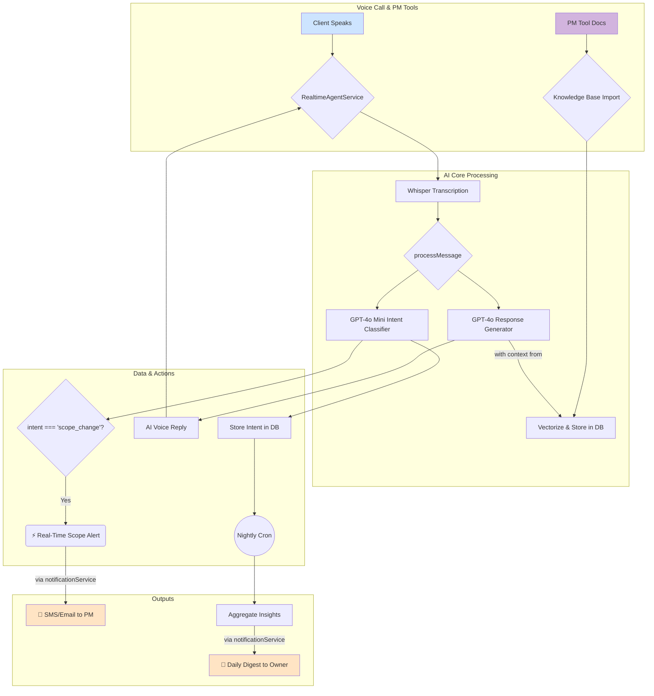

# Actionable Intelligence & Scope Guard: Technical Implementation Plan

**Version:** 2.0
**Status:** Ready for Implementation

---

## 1. Overview

### 1.1. The Goal
This document outlines a low-effort, high-impact plan to implement three critical features:
1.  **Actionable Client Intelligence:** Transform raw conversation data into trend reports that help agencies identify process improvements.
2.  **Scope-Creep Guard:** Proactively detect and alert project managers when a client's request may fall outside the agreed-upon project scope.
3.  **Integrated Knowledge Base:** Allow agencies to import documents from their Project Management tools to create a searchable knowledge base for the AI agent.

### 1.2. The Solution (MVP)
We will ship these features by building directly on our existing infrastructure.

-   **Intelligence** will be delivered via a daily email digest to the agency owner.
-   **Scope-Creep Alerts** will be sent in real-time via email to the project management team.
-   **Knowledge Base** content will be imported via the dashboard and used by the AI to answer questions more accurately.

### 1.3. Core Principles
-   **Leverage Existing Infrastructure:** Use our current stack (Node.js, PostgreSQL/pgvector, OpenAI, Twilio, cron, existing PM integrations) to minimize complexity.
-   **Server-Side First:** Deliver immediate value through automated back-end processes and notifications.
-   **Ship Fast, Iterate:** Build a solid foundation that can be enhanced with UI and more advanced features in subsequent sprints.

### 1.4. System Flow Diagram



---

## 2. MVP Implementation: Step-by-Step Guide

### 2.1. Foundational Layer: Intent Classification
**What it is:** A lightweight classifier that runs on every transcribed user message to categorize its core purpose (e.g., asking for status, questioning a deadline). This is the foundation for all subsequent intelligence features.

**How it works:** After transcription, we make a fast, secondary call to `gpt-4o-mini` using JSON mode. The prompt is engineered to return only a single, structured intent label, which is then attached to the message metadata.

**Code Implementation:**
1.  **Define the `MessageIntent` Enum** (new file: `src/types/custom.d.ts`):
    This creates a single source of truth for all intent labels. We'll add it to an existing `d.ts` file to avoid creating many small files.
    ```ts
    // src/types/custom.d.ts
    export type MessageIntent =
      | 'status'        // "What's the status of the homepage design?"
      | 'deadline'      // "When will the first draft be ready?"
      | 'scope_change'  // "Can we also add a blog section?"
      | 'billing'       // "I have a question about the last invoice."
      | 'greeting'      // "Hi, how are you?"
      | 'other';        // Fallback for uncategorized messages.
    ```

2.  **Patch `aiHandler.ts`** (`src/core/aiHandler.ts`):
    The classifier runs in parallel with the main response generation. This logic will be integrated into the `aiHandler` or a similar service that processes messages from the `realtimeAgentService`.
    ```ts
    // src/core/aiHandler.ts
    // ... inside a function like `processMessage` or a new `classifyIntent` function

    import { openai } from '../services/openai';
    import { MessageIntent } from '../types/custom';

    export async function classifyIntent(message: string): Promise<MessageIntent> {
      try {
        const { choices } = await openai.chat.completions.create({
          model: 'gpt-4o-mini',
          response_format: { type: 'json_object' },
          max_tokens: 50,
          temperature: 0,
          messages: [
            { role: 'system', content: 'You are an intent classifier. Return the single best intent label for the user\'s message from the following options: "status", "deadline", "scope_change", "billing", "greeting", "other". Your response must be a JSON object with a single key "intent".' },
            { role: 'user', content: message }
          ]
        });

        const intentResult = JSON.parse(choices[0].message.content || '{}');
        return (intentResult.intent ?? 'other') as MessageIntent;
      } catch (error) {
        console.error('[aiHandler] Intent classification failed:', error);
        return 'other';
      }
    }
    ```
    > ⚠️ **Database Change:** We will add a new `intent` column to the `CallLog` model's `messages` JSONB array. This is a non-breaking change as old messages simply won't have the key. We'll modify the part of the code that saves messages. For example, in `realtimeAgentService.ts` when appending to the log:
    > `state.messages.push({ role: 'user', content: transcript, intent: classifiedIntent });`

---

### 2.2. Feature 1: Real-Time Scope-Creep Alerts
**What it is:** An instant notification sent to the responsible project manager the moment a client's request is classified as a potential scope change.

**How it works:** In the main call processing pipeline, we add a simple `if` condition. If the `intent` is `scope_change`, we fire off a notification using the existing `notificationService`.

**Code Implementation** (`src/services/realtimeAgentService.ts`):
Inside the method that processes incoming audio/text, after the call to classify intent:
```ts
// src/services/realtimeAgentService.ts
// ... inside the method handling transcribed text from the user

import { classifyIntent } from '../core/aiHandler';
import { notificationService } from './notificationService';

// ...
const transcript = /* incoming transcript segment */;
const intent = await classifyIntent(transcript);

// Log the intent with the message
state.messages.push({ role: 'user', content: transcript, intent });

if (intent === 'scope_change') {
  console.log(`[SCOPE ALERT] Detected potential scope creep on call ${state.callSid}`);
  await notificationService.sendInstantAlert({
    businessId: state.businessId!,
    type: 'SCOPE_ALERT',
    message: `⚠️ Scope-creep request detected from caller ${state.fromNumber}: "${transcript.slice(0, 150)}…"`,
  });
}
// ...
```

---

### 2.3. Feature 2: Daily Actionable Intelligence Digest
**What it is:** A nightly email sent to agency owners summarizing the previous day's client conversation trends.

**How it works:** A scheduled cron job runs once per night. It fetches all calls from the previous day, aggregates the `intent` counts for each business from the `messages` log, and saves the summary to the database before emailing the digest.

**1. Data Model** (`prisma/schema.prisma`):
A new table to store the historical results.
```prisma
// prisma/schema.prisma

model DailyInsight {
  id          String   @id @default(uuid())
  businessId  String
  date        DateTime @db.Date
  insights    Json     // e.g., {"v":1,"topIntents":[["status",14],["deadline",5]]}
  createdAt   DateTime @default(now())

  business    Business @relation(fields: [businessId], references: [id], onDelete: Cascade)
  @@unique([businessId, date])
}
```
**Migration Command:** `pnpm prisma migrate dev --name add_daily_insights`

**2. Cron Job** (`src/monitor/insightsCron.ts` - new file):
```ts
// src/monitor/insightsCron.ts
import { prisma } from '../services/db';
import { subDays, startOfToday } from 'date-fns';
import { notificationService } from '../services/notificationService'; // Assuming this service exists and has a sendInsightsDigest method

export async function runDailyClientInsights() {
  console.log('Starting daily client insights aggregation...');
  const yesterday = subDays(startOfToday(), 1);

  const calls = await prisma.callLog.findMany({
    where: { createdAt: { gte: yesterday, lt: startOfToday() } },
    select: { businessId: true, messages: true },
  });

  const businessTallies = new Map<string, Record<string, number>>();

  for (const call of calls) {
    const { businessId, messages } = call;
    if (!businessId || !messages) continue;
    
    const tally = businessTallies.get(businessId) ?? {};
    // The `messages` field is JSONB, so we cast it.
    for (const msg of (messages as any[])) {
      if (msg.role === 'user' && msg.intent) {
        tally[msg.intent] = (tally[msg.intent] ?? 0) + 1;
      }
    }
    businessTallies.set(businessId, tally);
  }

  for (const [businessId, tally] of businessTallies.entries()) {
    if (Object.keys(tally).length === 0) continue;

    const payload = {
      v: 1,
      topIntents: Object.entries(tally).sort((a, b) => b[1] - a[1]).slice(0, 5),
    };

    await prisma.dailyInsight.upsert({
      where: { businessId_date: { businessId, date: yesterday } },
      update: { insights: payload },
      create: { businessId, date: yesterday, insights: payload },
    });

    try {
      // This method needs to be created in notificationService to format and send the email.
      await notificationService.sendInsightsDigest(businessId, payload);
    } catch (emailError) {
      console.error(`Failed to send digest for business ${businessId}`, emailError);
    }
  }
  console.log('Finished daily client insights aggregation.');
}
```
**3. Register Cron Job:**
You'll need a scheduler (like `node-cron` or a system cron) to execute `runDailyClientInsights()` every night.

---

### 2.4. Feature 3: Knowledge Base Integration with PM Software

**What it is:** Allow users to import documents (attachments, files, etc.) from their connected PM tools (Asana, Jira, Monday.com) into a vector-searchable Knowledge Base. The AI agent will use this KB to provide more accurate, context-aware answers.

**1. Data Model (`prisma/schema.prisma`)**
New models for storing imported content and its vector embeddings. Ensure your PostgreSQL database has the `pgvector` extension enabled (`CREATE EXTENSION IF NOT EXISTS vector;`).

```prisma
// prisma/schema.prisma

// Store imported source documents
model KnowledgeBaseDocument {
  id               String    @id @default(uuid())
  businessId       String
  provider         String    // e.g., 'ASANA', 'JIRA', 'MONDAY'
  providerSourceId String    // ID of the document in the source system
  name             String
  content          String?   @db.Text // Full content for reference
  createdAt        DateTime  @default(now())
  updatedAt        DateTime  @updatedAt

  business         Business  @relation(fields: [businessId], references: [id], onDelete: Cascade)
  chunks           KnowledgeBaseChunk[]

  @@unique([businessId, provider, providerSourceId])
}

// Store vectorized chunks of the documents for efficient search
model KnowledgeBaseChunk {
  id          String    @id @default(uuid())
  documentId  String
  content     String    @db.Text
  embedding   Unsupported("vector(1536)")? // For OpenAI text-embedding-ada-002 or similar
  createdAt   DateTime  @default(now())

  document    KnowledgeBaseDocument @relation(fields: [documentId], references: [id], onDelete: Cascade)
  @@index([documentId])
}
```
**Migration Command:** `pnpm prisma migrate dev --name add_knowledge_base_models`

**2. Update PM Provider Interface (`src/services/pm-providers/pm.provider.interface.ts`)**
Add methods to list and retrieve documents from each PM tool.
```ts
// src/services/pm-providers/pm.provider.interface.ts
// ... existing interface
export interface ProjectManagementProvider {
  // ... existing methods

  /**
   * Lists available documents/files from the provider that can be imported.
   * @param businessId - The ID of the business.
   * @returns A list of document metadata.
   */
  listImportableDocuments(businessId: string): Promise<{ id: string; name: string; createdAt: Date; type: string; }[]>;

  /**
   * Fetches the content of a specific document from the provider.
   * @param businessId - The ID of the business.
   * @param documentId - The ID of the document in the provider's system.
   * @returns The document's content as a string.
   */
  getDocumentContent(businessId: string, documentId: string): Promise<{ name: string; content: string; }>;
}
```
> **Note:** Implementations will vary. For Asana/Jira, this would involve fetching task/issue attachments. For Monday, it would be files from a "Files" column. Each provider (`asana.provider.ts`, `jira.provider.ts`, etc.) will need these methods implemented.

**3. API Layer (`src/api/knowledgeBaseRoutes.ts`)**
Create new endpoints to manage the import process.
```ts
// src/api/knowledgeBaseRoutes.ts
import { Router } from 'express';
import { authMiddleware } from './authMiddleware';
import { knowledgeBaseService } from '../services/knowledgeBaseService'; // new service to create

const router = Router();

// Lists connected providers that support document import
router.get('/import-sources', authMiddleware, knowledgeBaseService.listSources);

// Lists available documents from a specific provider
router.get('/import-sources/:provider/documents', authMiddleware, knowledgeBaseService.listProviderDocuments);

// Triggers the import and vectorization of a document
router.post('/import-sources/:provider/documents/:documentId', authMiddleware, knowledgeBaseService.importDocument);

export default router;
```
You will need to create `knowledgeBaseService.ts` to orchestrate the logic, calling the correct PM provider, chunking text, calling OpenAI's embedding API, and saving to the new DB tables.

**4. RAG Service Update (`src/core/ragService.ts`)**
Modify the Retrieval-Augmented Generation service to search the new `KnowledgeBaseChunk` table.
```ts
// src/core/ragService.ts
import { prisma } from '../services/db';
import { openai } from '../services/openai';

// ... inside a function like `getContextForQuery(query, businessId)`
export async function getContextForQuery(query: string, businessId: string): Promise<string> {
    const [{ embedding: queryVector }] = await openai.embeddings.create({
        model: 'text-embedding-3-small', // Use a modern, cost-effective model
        input: query,
        dimensions: 1536,
    });

    // Use pgvector's cosine distance to find the most relevant document chunks.
    const chunks = await prisma.$queryRaw<[{ content: string }]>`
        SELECT content
        FROM "KnowledgeBaseChunk"
        WHERE "documentId" IN (
            SELECT id FROM "KnowledgeBaseDocument" WHERE "businessId" = ${businessId}
        )
        ORDER BY embedding <=> ${queryVector}::vector
        LIMIT 5
    `;

    if (!chunks || chunks.length === 0) {
        return "";
    }

    // Combine chunk content into a context string to pass to the LLM.
    const context = chunks.map(c => c.content).join('\n\n---\n\n');
    return `Context from knowledge base:\n${context}`;
}
```
This `context` string would then be prepended to the system prompt in your main AI handler (`aiHandler.ts`) to give the LLM the necessary information to answer questions.

---

## 3. Deployment & Testing

**3.1. Deployment Checklist:**
1.  Add `pgvector` extension to your PostgreSQL database: `CREATE EXTENSION IF NOT EXISTS vector;`.
2.  Run and apply Prisma migrations: `pnpm prisma migrate deploy`.
3.  Deploy the updated application containers.
4.  Configure the new cron job (`insightsCron.ts`) to run nightly.
5.  **Smoke Test (Scope Alert):** Place a test call and say, "Can we add two extra pages to the website?". This should trigger a real-time `SCOPE_ALERT` notification.
6.  **Smoke Test (KB):** Import a document from a PM tool via the (to-be-built) dashboard UI, then ask the AI a question that can only be answered using that document's content.

**3.2. Testing Strategy:**
-   **Unit Tests (Jest):**
    -   Test the `runDailyClientInsights` cron job using a mock Prisma client.
    -   Test the document chunking and embedding logic for the KB import.
    -   Add golden-path tests for the `classifyIntent` function.
    -   Test the `getContextForQuery` RAG function with mock vectors.
-   **Integration Tests:**
    -   Test the full flow from `realtimeAgentService` -> `classifyIntent` -> `notificationService`.
    -   Test the full KB import flow from the API endpoint through the service layer to the database records.

---

## 4. Future Roadmap: Scaling the Platform

| # | Upgrade | Description | Effort |
|---|---|---|---|
| ❶ | **Realtime Dashboard** | Replace the daily digest email with a live chart in `/dashboard/analytics`. Use WebSockets or Supabase Realtime to push `DailyInsight` updates to the browser. | 1-2 Days |
| ❷ | **Slack/Teams Alerts** | Add a webhook URL to `Business.settings`. Let PMs get scope-creep alerts directly in their chat client of choice. | 0.5 Days |
| ❸ | **Streamlined Proposals** | When `scope_change` is detected, have the AI offer to draft a change order email or a new proposal, pre-filled with details from the conversation. | 2-3 Days |
| ❹ | **Custom Intents** | Allow agencies to define their own intent labels (e.g., `creative_feedback`, `technical_question`) in the dashboard to get more tailored insights. | 2-3 Days |
| ❺ | **Vector-Powered Scope Guard** | Implement an advanced scope guard. Vectorize the original project scope document. When a `scope_change` intent is detected, compare the user's request vector against the scope vector. A high cosine distance triggers a more confident alert. | 1-2 Days |

---

Happy shipping! 🚀 